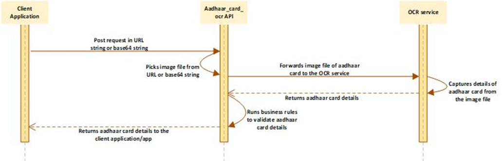

# Aadhaar Card
## API Name
Aadhaar_card_ocr

## Overview
This API receives the request in the form of URL string or base64 string. It picks the image file of the aadhaar card from the request and then captures aadhaar card’s details. It internally parses and then validates the details of the aadhaar card. Therefore, it returns aadhaar card’s details to the client application.

## How it Works

## Features and Benefits
* Faster and linear API execution and frictionless user experience
* Receives data input in the URL and base64 string formats
* Captures the details from the front and the back page of the aadhaar card
* Efficiently captures the details from cropped, rotated, and disoriented image files
* Can be scaled up to achieve desired throughput
* Light-weight and easily integrated with other services 

## Security and Compliance
* Secured Socket Layer based data encryption
* RBI Compliance
* UIDAI compliance
* Imparts authentication policies
* Maintains data confidentiality across all medium and data channels

## Technical Details
### Description
This API receives the request in the form of URL string or base64 string. It captures the image file of the aadhaar card from the request Therefore, it internally invokes another service that picks the details of aadhaar card from the image.

The **aadhaar_card_ocr** service validates the aadhaar card on the basis of the configured keyword, **UIDAI**. After the aadhaar card is successfully validated, it returns the details of the aadhaar card holder.

### Request Parameters

|Parameter Name|Description|
|-------|------|
|**Front**|This is a JSON object that stores the input data that the aadhaar_card_ocr API receives from the request. It stores the following information: <ul><li>The source type that denotes the type of input string (**URL_image** or **base64_image**) contained in the request.</li><li>The input string that contains the front page's image of the aadhaar card.</li></ul>|
|**Back** (optional)|This is a JSON object that also stores the input data that the **aadhaar_card_ocr** API receives from the request. It stores the following information: <ul><li>The source type that denotes the type of input string (**URL_image** or **base64_image**) contained in the request.</li><li>The input string that contains the back page's image of the aadhaar card.</li></ul>.|
|**Source_type**|This parameter stores any of the following values: <ul><li>**url_image:** This value specifies that the **aadhaar_card_ocr** API receives the URL string in the request.</li> <li>**Base64_image** This value specifies that the **aadhaar_card_ocr** API receives the Base64 string in the request.</li></ul>|
|**Source**|This parameter either stores the URL string or Base64 string. The **aadhaar_card_ocr** API receives the request. These string types contain the file name of aadhaar card’s image from where the **aadhaar_card_ocr** API captures the details of the aadhaar card.|
|**Document_type**|This parameter stores a constant value named **aadhaar**. This value specifies that the incoming request contains the images of aadhaar card document.|

### Response Parameters

|Parameter|Description|
|-------|--------|
|**RESPONSE**|This parameter stores the status of the request as follows: <ul><li>**I:** This value specifies that the API successfully returns the details of the aadhaar card.</li> <li>**E:** This value specifies that the API fails to return the details of the aadhaar card.</li></ul>|
|**RESPONSE_MSG**|This parameter stores any of the following response messages: <ul><li>**Success** This value specifies that the API successfully returns the details of the aadhaar card.</li> <li>**Error Message** The **RESPONSE_MSG** parameter stores the error message if the API fails to return the details of the aadhaar card.</li></ul>|
|**DATA**|This is a JSON object that stores the personal information of the aadhaar card holder, such as **_name_**, **_gender_**, **_mobile number_**, **_father’s name_**, document number, etc. in addition to the details that are captured from the front page and the back page of the aadhaar card.|
|**Text-front**|This is a JSON object that stores the details that are captured from the front page of the aadhaar card.|
|**Text_back**|This is also a JSON object that stores the details that are captured from the back page of the aadhaar card document.|

To see the PAN Card API's request and response samples, [click here](docs\samples\aadhaar-card-sample.mdx)

