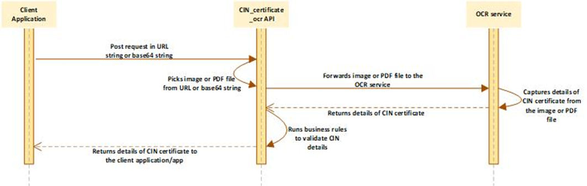

# CIN Certificate
## API Name
CIN_certificate_ocr

## How it Works

## Features and Benefits
* Light-weight REST based end-to-end implementation
* A complete automated solution to capture the details of CIN certificate
* Smooth execution and frictionless user experience
* Capable to capture the details of CIN certificate in PDF and other image type formats
* Simple Request/Response type data pattern
* Secured Socket Layer based data encryption

## Security and Compliance
* Secured Socket Layer based data encryption
* RBI Compliance
* Maintains data confidentiality across all mediums and data channels, etc

## Technical Details
### Description
**CIN_certificate_ocr** is a RESTful API that is encoded in Python based programming code. When a request is posted to the end-point URL, this API is invoked. This API receives the CIN certificate as an input in two formats: PDF file or image file (**JPEG**, **PNG**, etc.). In turn, it also invokes OCR (**Optical Character Reader**) service that executes to capture the details of CIN certificate. Based on the positioning and the alignment of the text, Google’s OCR service captures the details of the CIN certificate.

Based on the captured details of CIN certificate, the **CIN_certificate_ocr** API executes internal business rules and returns the details of CIN certificate.

### Request Parameters

|Name of Parameter|Description|
|-----|------|
|**source_type**|This parameter stores any of the following values: <ul><li>**url_image:** This value specifies that the request contains the URL string as an input value. The URL string contains the image of the CIN certificate.</li></ul> <ul><li>**Base64_image:** This value specifies that the request contains the base64 string as an input value. The base64 string contains the image of the CIN certificate.</li></ul> <ul><li>**url_pdf:** This value specifies that the request contains the URL string as the input value. The URL string contains the PDF file of the CIN certificate.</li></ul>|
|**source**|This parameter stores the URL string or based 64 string that contains the image file or the PDF file of the CIN certificate.|

### Response Parameters

|Name of Parameter|Description|
|------|-------|
|**DATA**|This JSON type object stores the exhaustive details of the CIN certificate.|
|**address**|This parameter stores the address of the corporate entity.|
|**cin**|This parameter stores the complete CIN number in the string format.|
|**cin_splitted**|This parameter, as a JSON object, stores the CIN number in the split string-set.|
|**company_name**|This parameter stores the name of company (corporate entity).|
|**RESPONSE**|This parameter stores the status of a request as follows: <ul><li>**I:** This value specifies that the API successfully returns the details of the CIN certificate.</li></ul> <ul><li>**E:** This value specifies that the API fails to return the details of the CIN certificate.</li></ul>|
|**RESPONSE_MSG**|This parameter stores any of the following response messages: <ul><li>**Success:** This value specifies that the API successfully returns the details of the CIN certificate.</li></ul> <ul><li>**Error Message:** The RESPONSE_MSG stores the error message if the API fails to return the details of the CIN certificate.</li></ul>

To see the CIN Certificate API's request and response samples, [click here](docs\samples\cin-certificate-sample.mdx).

 

